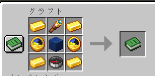

# CelestialLocator    

Minecraft Utility Datapack    
Celestial Sphere locates surrounding biomes and structures.    

Minecraft 便利系データパック    
周囲のバイオームと構造物を描写する天球儀を追加します。    

## Version / バージョン
Minecraft 1.19.4

## Dependencies / 前提データパック
AiMath https://github.com/Ai-Akaishi/AiMath (赤石愛 様)    

## How to Use / 使い方

- Obtain / 入手    
Recipe / レシビ    
    
loot command / lootコマンド    
`loot give @s loot celestial:celestial_locator`

- Place to Activate / 設置して起動    
Lags may occur.    
ラグが発生することがあります。    
- Click to Collect / クリックして回収    

## Language / 言語
English    
日本語    

## Contact / 連絡
<https://twitter.com/irohamaru3>

## LICENSE / ライセンス
These codes are released under the MIT License, see LICENSE.